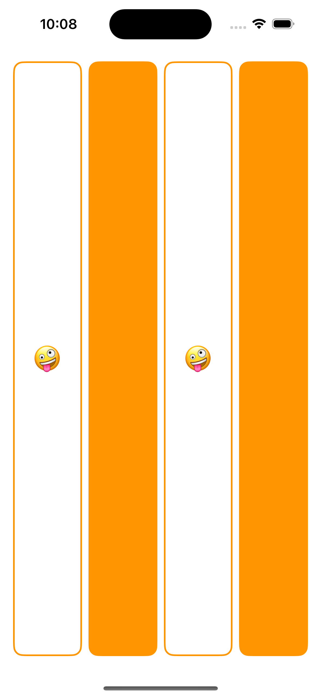

## Lecture 1 -  Getting Started with SwiftUI

Start working on the first application of the quarter, a card-matching game called Memorize.  This will be the foundation for the first few weeks of course material.

[Video](https://www.youtube.com/watch?v=n1qabtjZ_jg)

[Reading Assignment 1](https://cs193p.sites.stanford.edu/sites/g/files/sbiybj16636/files/media/file/r1_0.pdf)

## Demo

