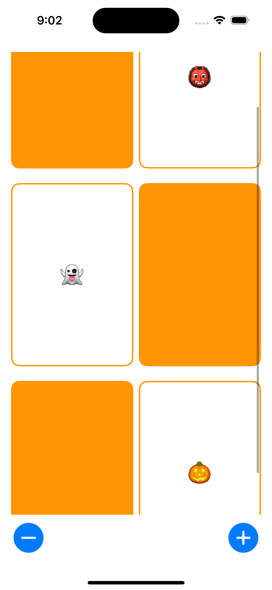

## Lecture 2 -  More SwiftUI

Development on Memorize continues.  Creating custom Views.  Handling a tap gesture.  Adding buttons.  Factoring shared code.

[Video](https://www.youtube.com/watch?v=sXiD-2XrkKQ)

[Programming Assignment 1](https://cs193p.sites.stanford.edu/sites/g/files/sbiybj16636/files/media/file/a1_0.pdf)

## Note
### `: View`
- Behaves like a View
- var body: some View

### Source Control
- Menu item
    - In Xcode 16, Integrate > Commit (⌥ + ⌘ + C)
- Local commit
- Add Account, before control remote repository
    - Settings > Accounts > +
- Push to remote
- Grading Feedback
    - Show remote pull request

### Trailing closure syntax
- like ZStack { ... }

### Fill
- Shape default is fill, filling it with color that is background
- Replace `.foregroundColor(.white)` to `.fill(.white)`

### Locals in @ViewBuilder
- Conditional list and local variables assignments right

### let v.s. var
- `let` is constant, never change
- `var` is variable, values are changed

### Type inference
- Figures out the type of a variable or constant based on the value assigned to it
- Hold down option(⌥) and click on a variable, it'll tell you inferred from what the code says
- Almost always let Swift infer as opposed to explicitly putting the type

### onTapGesture
- Execute when someone taps on this View
- `.onTapGesture { ... }` trailing closure syntax
    - - `.onTapGesture(perform: { ... })` 
- Print to console
    - Debug Area > Console > Previews
    - `print("tapped")`

### Views are immutable
- Even it's a `var` property couldn't change
- SwiftUI enforces immutability of its views
- Recalculates the view's hierarchy dynamically based on the state
- body is a computed property and decide how to update the UI efficiently
- @State
    - Property wrapper used to manage the state of a View    
    - Makes a property mutable within a View
    - `.toggle()` changes the value of it from True to False, False to True, back and forth

### Inject content parameter
- let content: String
- CardView(content: "👻")
- instead of ghost text

### Array
- Generic type
- Array<Element>
    - Alternate Array Notation
    - Full generic syntax
- [Element]
    - Shorthand notation
    - Syntactic Sugar
    - More common and preferred in Swift due to its simplicity and readability
- Empty array
    - Explicit type
        - `let emptyArray: [String] = []`
    - Type inference
        - `let emptyArray = [String]()`
        - `let emptyArray = Array<String>()`

### ForEach
- In @ViewBuilder can do
    - conditional
    - list
    - local variable
- Range
    - `0 ..< 4`
        - e.g. `ForEach(0 ..< 4) { index in Text(emojis[index]) }`
    - `emojis.indices`
    - e.g. `ForEach(emojis.indices) { index in Text(emojis[index]) }`
- Arguments to closure
    - `index`
    - e.g. `ForEach(0 ..< 4) { index in ... }`

### Button
- init
    - `init<S>(_ title: S, action: @escaping () -> Void) where S : StringProtocol`
    - `init(action: @escaping () -> Void, @ViewBuilder label: () -> Label)`
- Action
    - Perform when the user triggers the button
- Title
    - A string that describes the purpose of the button
- Label
    - A view that describes the purpose of the button
- Image(systemName:) Lookup
    - Show Library(+) > Symbols
    - Scale
        - `.imageScal(.large)`
        - `.font(.largeTitle)`
- Edge case

### Extract View
- var body could be simper to understand
- Encapsulate
    - cards
    - cardCountAdjusters
- Fundamental component
    - var cards: some View { ... }
    - var cardCountAdjusters: some View { ... }

### Implicit return
- Single-line expressions (in functions or computed properties) don't need to explicitly write `return`

### func
- First is caller use, and second is inside use
- External parameter names
    - Used when calling the function
    - Improve clarity for the function caller
- Internal parameter names
    - Used inside the function body
    - Provide meaningful identifiers for use within the function
- By default, the parameter name as both the internal and external name  
### LazyVGrid
- columns is an array of grid items to size and position each row of the grid
    - GridItem size, default is `.flexible()`
        - fixed(CGFloat)
        - flexible(minimum: CGFloat = 10, maximum: CGFloat = .infinity)
        - adaptive(minimum: CGFloat, maximum: CGFloat = .infinity)
- If you want 3 column can't use `LazyVGrid(columns: 3)`, need use `LazyVGrid(columns: [GridItem(), GridItem(), GridItem()])`
- Using .adaptive means grid items fill each row as much as possible, with the minimum specifying the smallest width for each item.

### opacity v.s. if-else in @ViewBuilder
- A whole row of cards shrinks down because LazyVGrid automatically minimizes the size of its items to fit the content. If the cards are face-down with no visible emoji, they become very small. To address this issue, I used `opacity` instead of `if-else` to keep the layout consistent.
- Setting the opacity to 0 hides the content without removing the view from the layout(showing the background), preserving the grid structure.

### Group
- Kind of like a ForEach for just one view or a small set of views, allowing to group them together without affecting the layout or adding additional containers, it's a lightweight way to organize views without changing how they're displayed.

### aspectRatio
- CardView.aspectRatio(2 / 3, contentMode: .fit)

### ScrollView
- ScrollView { cards }

## Demo
