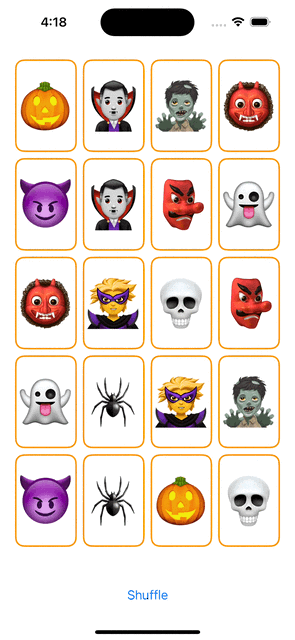

## Lecture 4 - Applying MVVM

[Video](https://www.youtube.com/watch?v=4CkEVfdqjLw)

- use ViewModel in View
- mutating function
- Reactive UI
    - ViewModel should
        - conform to `ObservableObject`
        - `@Publicsh` something changed
    - View should
        - Reflects the Model, use `@ObservedObject` 
            ```swift
            @ObservedObject
            var viewModel: EmojiMemoryGame            
            ```
    - App keep the object state, use `@StateObject`
        ```swift
        @StateObject
        var game = EmojiMemoryGame()
        ```
---        


