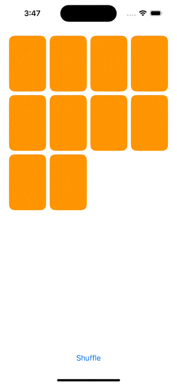

## Lecture 5 - Protocols, enum, Optional

[Video](https://www.youtube.com/watch?v=F1x-H8kEwo8)

### Protocol
- Equatable
    ```swift
    struct MemoryGame<CardContent> where CardContent: Equatable { ... }
    struct Card: Equatable { ... }
    ```
- Identifiable
    - each element in the collection has a stable and unique identifier
        ```swift    
        struct Card: Equatable, Identifiable {
            ...
            var id: String
        }
        ```
- CustomStringConvertible
    - A textual representation of this instance
### Enum
- Value type, like struct
- have methods and computed properties, but NO stored properties
- Associate Data
    - store associated values of case
        ```swift
        enum FastFoodMenuItem {
            case hamburger(numberOfPatties: Int)
            case fries(size: FryOrderSize)
            case drink(String, ounces: Int) // the unnamed String is th barnd, e.g. "Coke"
            case cookie
        }
        enum FryOrderSize {
            case large
            case small
        }

        var menuItem = FastFoodMenuItem.drink("Coke", ounces: 32)
        switch menuItem {
        case .hamburger(let pattyCount):
            print("a burger with \(pattyCount) patties!!")
        case .fries(let size):
            print("a \(size) oder of fries!")
        case .drink(let brand, let ounces):
            print("a \(ounces)oz \(brand)")
        case .cookie:
            print("a cookie!")
        }        
        ```
- break
    - case don't want to do anything
- default
    - switch must handle `all posible cases`, although you can `default` uninteresting cases
    - switch on any type, not just enum
        ```swift
        let s = "hello"
        switch s {
        case "goodbye": ...
        case "hello": ...
        default: ... // gotta have this for String because switch has to cover ALL cases
        }
        ```
- fallthrough
    - execution to continue from one case in a switch statement to the next case
- CaseIterable
    - Have a static var `allCases` theat cat iterate over.

### Optional
- An enum. is set(some) or not set(none)
```swift
enum Optional<T> {
    case none
    case some(T)
}
```
- Syntactic sugar
    - `Optional<T>` can be done with `T?`

- Unwrapp
    - if let
    - guard let
    - optional defaulting
        - nil-coalescing operator(`??`)
    - force(with `!`)
        - avoid to use, it’s often called the crash operator

---        


