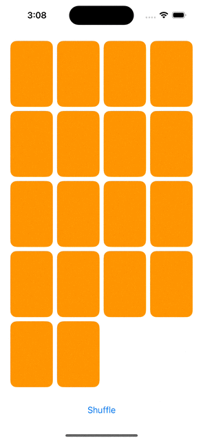

## Lecture 6 - Layout, @ViewBuilder

[Video](https://www.youtube.com/watch?v=fYlMD9llu7w)

### Layout
- HStack and VStack
    - Spacer
    - Divider
    - layoutPriority
    ```swift
    // UIKit    
    let label1 = UILabel()
    label1.text = "Short text"
    label1.setContentHuggingPriority(.defaultHigh, for: .horizontal)
    label1.setContentCompressionResistancePriority(.defaultLow, for: .horizontal)

    let label2 = UILabel()
    label2.text = "Much longer text"
    label2.setContentHuggingPriority(.defaultLow, for: .horizontal)
    label2.setContentCompressionResistancePriority(.defaultHigh, for: .horizontal)
    // SwiftUI
    Text("Short text")
        .layoutPriority(1)

    Text("Much longer text")// default is 0
    ```
    - alignment
        - Automatically adjust for RTL
- LazyHStack and LazyVStack 
    - lazy loading
    - use in ScrollView
- LazyHGrid and LazyVGrid 
    - Lazy X Grid with columns
- Grid 
    - like table of data
    - across columns and rows with modifiers
- ScrollView
    - to fit along the axis your scrolling on
- ViewThatFits
    - dynamic type sizes
- Form and List and OutlineGroup and DisclosureGroup
    - smart VStacks, scrolling, selection, hierarchy, etc.
- Layout protocol
    - sizeThatFits, placeSubviews
- ZStack
    - fit its children
- Modifier
    - background
    - overlay
    - padding
    - aspectRatio
- GeometryReader
    - GeometryProxy
        - size be offered by container
- Safe Area
    - edgesIgnoringSafeArea()


### @ViewBuilder
- List of Views and combines them into one
- `Any func` or `read-only computed var` can be marked with `@ViewBuilder`
```swift
@ViewBuilder
func front(of card: Card) -> some View {
    let shape = RoundedRectangle(cornerRadius: 20)
    shape.fill(.white)
    shape.stroke()
    Text(card.content)
｝
```
- With layout
    - a function that returns a View

## Demo


