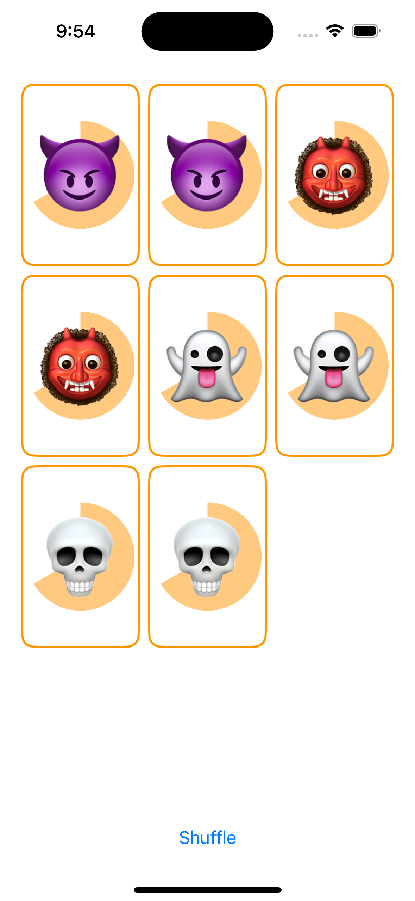

## Lecture 7 - Shape, ViewModifier, Constants

How to draw shapes in SwiftUI (e.g. a "pie" shape needed for a future Memorize feature).  How to create custom ViewModifiers (e.g. one that "card-ifies" any view, not just our Memorize game card).  Along the way, introduce a formalism for cleanly adding constants to our code.

[Video](https://youtu.be/KR7DXJYhkBw)

## Shape
- Shape support .fill(),.stroke()

- if you want to careate youre own Shape
    - conform to `Shape`, required implement path function
    - return `Path` that draws anything you want
    - it's can add lines, arcs, bezier curves, etc., together to make a shape

## ViewModifier
- calling a function in View, like `.padding()`,`.aspectRatio(2/3)`
- if you want to careate youre own ViewModifier
    - conform to `ViewModifier`, required implement body function
    - return `some View` that almost cetainly contains content
    - call .modifier on a View, the content passed to this body function is that View
    - MyViewModifier implements ViewModifier and aView will be passed to its body via content
        ```swift
        aView.modifier(MyViewModifier(arguments: ...))
        MyViewModifier: ViewModifier {
            var argument: String
            func body(content: Content) -> some View {
                Text(argument) 
            }
        }
        ```
    - easy way, extension View
        ```swift
        extension View {
            func myViewModifier(arguments: ...) -> some View {
                self.modifier(MyViewModifier(arguments: arguments))
            }
        }
        ```
## protocol
- add `filter` to the Foundation library as an extension to the Sequence protocol
    ```swift
    filter(_ isInclued: (Element) -> Bool) -> Array<Element>
    ```
- talk about `View`
- Generics + Protocols
- some
    - opaquely in or out of a function/var
        - out, like return value
            ```swift
            var body: some View { 
                if viewModel.rounded {
                    RoundedRectangle(cornerRadius: 12)
                } else {
                    Rectangle()
                }
            }
            ```
        - @ViewBuilder always returns the same type
            ```swift
            @ViewBuilder var body: some View { ... }
            ```
        - in, as a parameter to a function
            ```swift
            func fill<S>(_ whtaToFillWith: S) -> View where S: ShapeStyle
            // more simply
            func fill<S>(_ whtaToFillWith: some ShapeStyle) -> View
            // more advantage
            func fillAndStroke(shape: some Shape) -> some View {
                ZStack {
                    shape.fill(.white)
                    shape.stroke()
                }
            }
            ```
- any
    - use to create a heterogeneous Array
        ```swift
        let ids = [any Identifiable]()
        func printId(of identifiable: some Identifiable) { 
            print (identifiable. id) 
        }
        ```


## Demo
