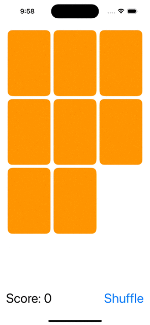

## Lecture 8 - Animation (Part 1)

First of a two-part animation adventure. Implicit animation vs. explicit animation. Animation curves. Animating a ViewModifier (flipping cards).

[Video](https://youtu.be/L7hmw4ISh1A)


## Property Observers
- computed var `willSet`
    ```swift
    var isFaceUp: Bool {
        willSet {
            if newValue {
                startUsingBonusTime()
            } else {
                stopUsingBonusTime()
            }
        }
    }
    ```
- .onChange(of:) on an `@State`
    ```swift
    @State private var taps = 0
    ...
    Text ("\(taps) taps")
        .onChange(of: viewModel.cards) { newCards in
            taps += 1
        }    
    ```
## Animation
- Only changes can be animated
    - ViewModifier arguments(including GeometryEffect modifiers)
    - Shapes
    - Transitions (animating the appearance/disappearance of Views)
- make an animation happen
    - Implicit
        - Automatic animation, `.animation(Animation, vaule:)`
            ```swift
            Text("👻")
                .opacity(card. scary ? 1 : 0)
                .rotationEffect(Angle.degrees(card.upsideDown ? 180 : 0))
                .animation(Animation.easeInOut, value: card)
            ```
        - Animation type
            - .linear : consistent rate throughout
            - .easeInOut : Starts out the animation slowly, picks up speed, then slows at the end
            - .spring : Provides "soft landing" (a "bounce") for the end of the animation
        - On Views that are typically working independently of other Views.

    - Explicit
        - executing a block of code will be animated together, wrapped around calls to ViewModel Intent functions
            ```swift
            withAnimation(.linear(duratrion: 2)) {
                // do something that will cause ViewModifier/Shape arguments to change somewhere                
            }
            ```
        - Explicit animations do not override an implicit animation

    - Transitions
        - animate the arrival/departure of Views, only work for Views that are inside CTAAOS(Containers That Are Already On-Screen)
        - a "changes in arguments to ViewModifiers" animation
            - A pair of ViewModifiers, "before" and "after"
            - An asymmetric transition has 2 pairs of ViewModifiers
                - One pair for appear(insertion), another pair for disappear(removal)
            - Mostly we use "pre-canned" transitions on the `AnyTransition` struct.
        - All the transition API is `type erased`, AnyTransition which erases type info for the underlying ViewModifiers. 
            - .opacity (uses opacity modifier to fade the View in and out)
            - . scale (uses. frame modifier to expand/shrink the View as it comes and goes)
            - .offset(CGSize) (use offset modifier to move the View as it comes and goes)
            -  modifier(active: identity:) (you provide the two ViewModifiers to use)
        - Using - transition(). Example using two built-in transitions, scale and identity
            ```swift
            ZStack{
                if isFaceUp {
                    RoundedRectangle(cornerRadius: 10).stroke()
                    Text("👻").transition(AnyTransition.scale)
                } else {
                    RoundedRectangle(cornerRadius: 10).transition(AnyTransition. identity)
                }
            }      
            ```
        - Declaring what transition to use, not causing the transition to occur.
            ```swift
                transition(AnyTransition.opacity.animation(.linear(duration: 20)))
            ```
        - Matched Geometry Effect
            - moving from source position to different one in the destination position
            ```swift
                matchedGeometryEffect(id: ID, in: Namespace)
                @Namespace private var myNamespace
            ```
        - .onAppear
            - View executes a closure any time a View appears on screen called .onAppear{ ... }

    - Shape and ViewModifier Animation
        - Animationable Protocol
        - implement `var animationableData: Type`, Type has to implement VectorArithmetic protocol
        - setter : Shape/VM which "piece" to draw
        - getter : start/end points of an animation


## Demos
- Explicit Animation (shuffling and choosing cards)
- Implicit Animation (celebrating a match!)
- Animatable ViewModifier (flipping the cards over)
- Suppressing unwanted animation (- animation (nil))


## Demo
