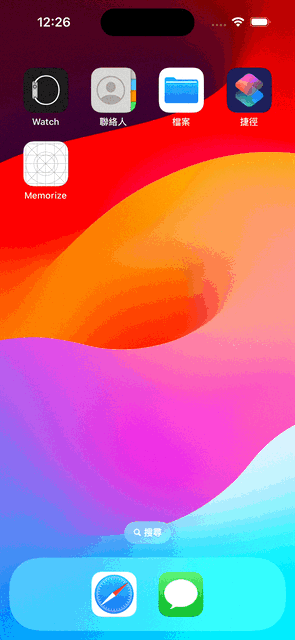

# Programming Assignment 1

### [Code](../../Memorize/Memorize/Programming%20Assignment%201)

### Required Tasks
1. Add a title **Memorize!** to the top of the screen. It’s a title, so it should be in a large font.
2. Add at least 3 **theme choosing** buttons to your UI. Each button should replace all card emojis with new ones from the selected theme (e.g., a "Halloween" theme).
3. The face up or face down state of the cards should not change when the user changes the theme.
4. Ensure each of the three themes has a different number of pairs of cards, with a minimum of 4 pairs per theme.
5. Cards should appear in a random order each time a theme button is chosen.
6. Theme-choosing buttons must include an image and text describing the theme, stacked vertically.
---
### Screenshot

