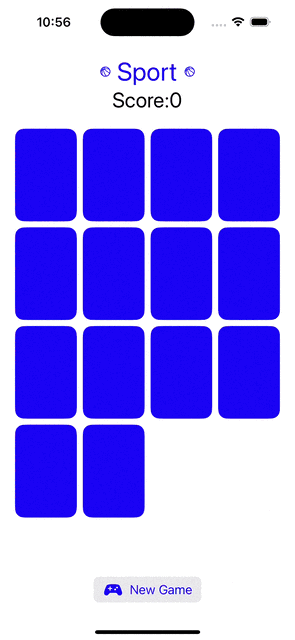
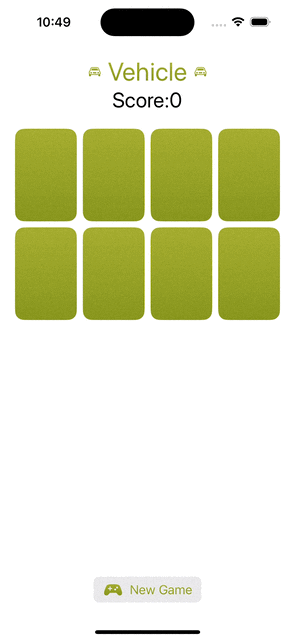
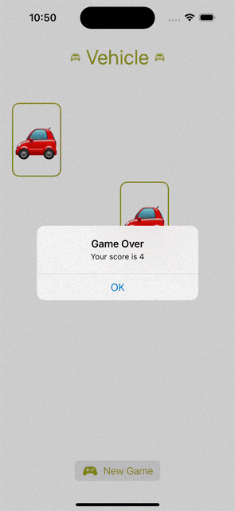

# Programming Assignment 2

### Required Tasks
1. Add a `New Game` button to your UI which begins a
brand new game.
2. Support at least 6 distinct Themes in your game.
3. The cards in a new game should all start face down and shuffled.
4. Display the score in your UI.
5. Keep score in your game by penalizing 1 point for every previously seen card that is
involved in a mismatch and awarding 2 points for every match (whether or not the cards
involved have been “previously seen”).
---
### Screenshot
- Themes

- Scores

- Finish game

