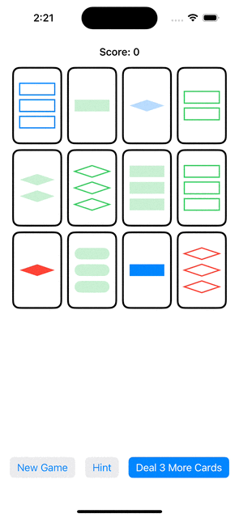
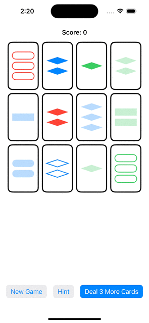
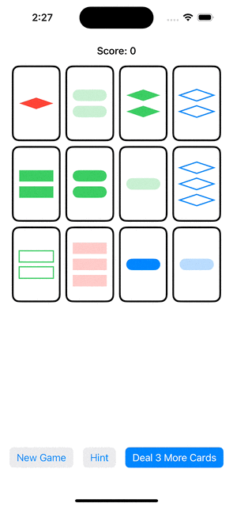
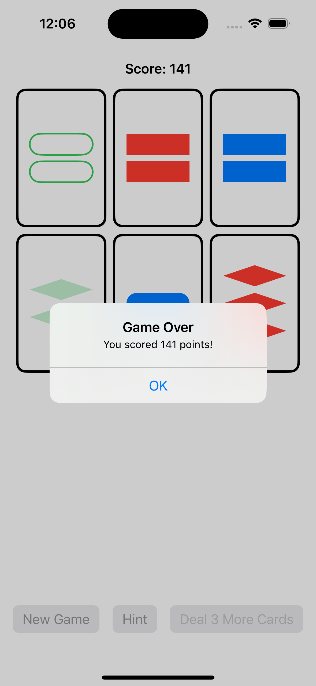
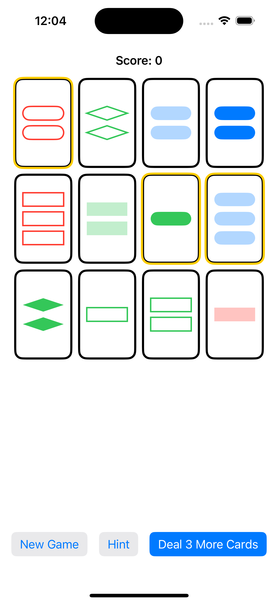
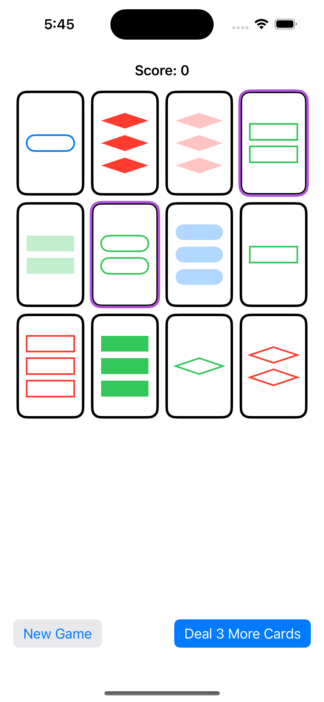
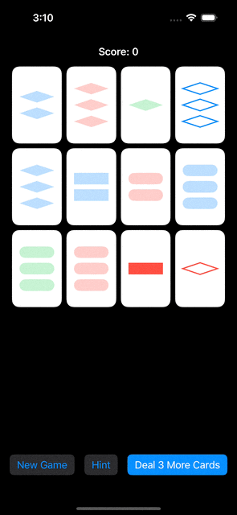

# Programming Assignment 3

### [Code](../../SetGame/Programming_Assignment_3)

### Required Tasks
1. Implement a game of solo (i.e. one player) Set.
2. Users must be able to select up to 3 cards by touching on them in an attempt to make
a Set.
3. **Deal 3 More Cards** button.
4. **New Game** button.
5. Replace the **squiggle** appearance in the Set
game with a rectangle.
6. use a semi-transparent color to represent
the **striped** shading.

### Extra Credit
1. Keep score in Set game.
2. Give higher scores to players who choose matching Sets faster.
3. Penalize players who choose "Deal 3 More Cards" when a set is actually available.
4. Add a **Hint** button.
---
### Screenshot
- Deal 3 More Cards

- New Game

 
- Start Game to Game Over

 
- Game Over

 
- Hint

 
- Select Card

- Work in portrait and landscape on dark mode

