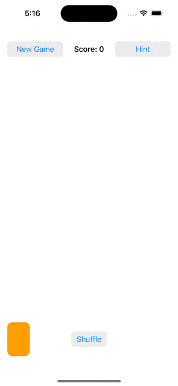
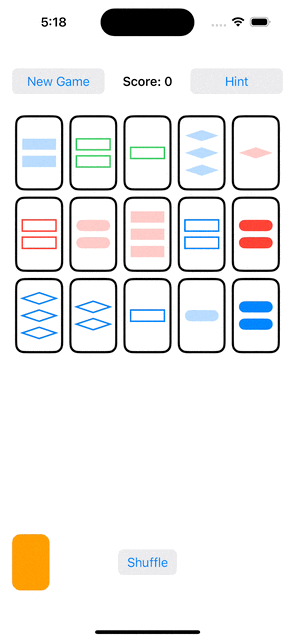
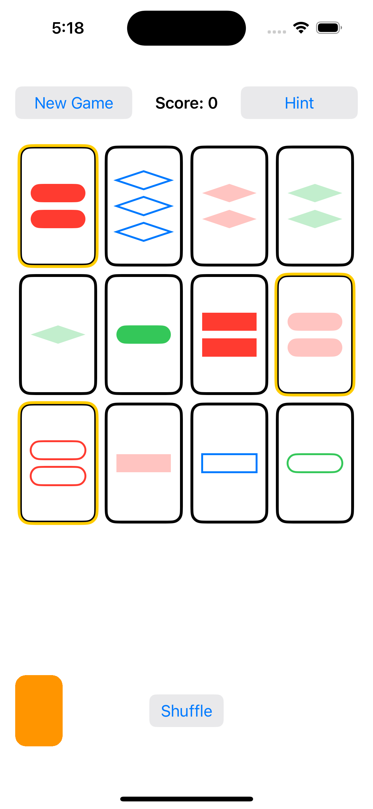

# Programming Assignment 4

### [Code](../../SetGame/Programming_Assignment_4)

### Required Tasks
- [X] 1. Continue playing a solo game of Set
- [X] 2. Remove matched cards instead of replacing them
- [X] 3. Add a **deck** to the UI 
    - [X] 3.1. Replace **Deal 3 More Cards** button with tapping on the deck to deal
    - [X] 3.2. Animate new cards **flying** from the deck into place
- [X] 4. Add a **discard pile** to the UI, and animate discarded cards to **fly** to the discard pile
- [X] 5. Animate card repositioning and resizing
- [ ] 6. Use animation to draw attention to matches and mismatches distinctly
- [X] 7. Add and animate a shuffle button, triggered by tapping on the deck to shuffle

### Extra Credit
- [X] 1. Animate initial dealing of 12 cards

---
### Screenshot
- New Game

- Deal More Cards

- Shuffle Card

- Get Hint

- Playing Game

