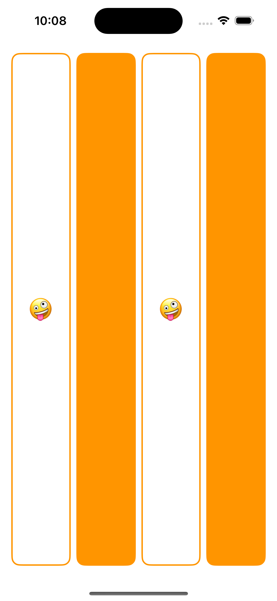
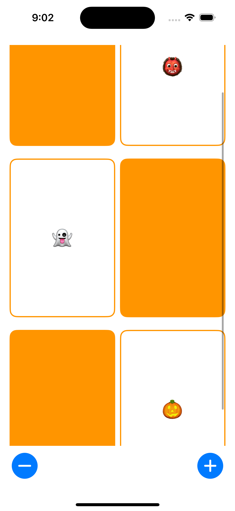

# CS193p - Developing Apps for iOS
[cs193p](https://cs193p.sites.stanford.edu/2023)

## Lecture 1 -  Getting Started with SwiftUI

[Video](https://www.youtube.com/watch?v=n1qabtjZ_jg)

[Reading Assignment 1](https://cs193p.sites.stanford.edu/sites/g/files/sbiybj16636/files/media/file/r1_0.pdf)

## Lecture 2 -  More SwiftUI

[Video](https://www.youtube.com/watch?v=sXiD-2XrkKQ)

[Programming Assignment 1](https://cs193p.sites.stanford.edu/sites/g/files/sbiybj16636/files/media/file/a1_0.pdf)

